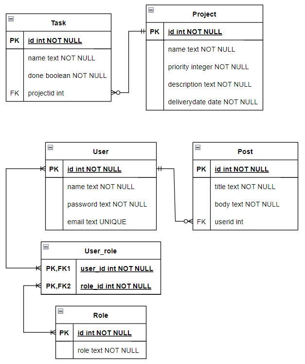

# testing-NodeJS-REST-API-PostgreSQL-Sequelize.

First personal testing project to learn the use of the above technologies, [based in this tutorial](https://www.youtube.com/watch?v=sA3t4d1v7OI) and [this one](https://www.youtube.com/playlist?list=PLn9Y084aviLmTy5TO6sw6Ky6NjEO5uCme). Both in Spanish.  
Using Postman for API testing, you can check the JSON file in the 'postman' folder.

This is the Entity–relationship model used in this example:

  _The result are two unrelated groups due to two different tutorials have been followed_

